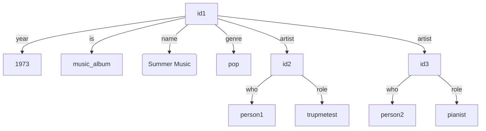
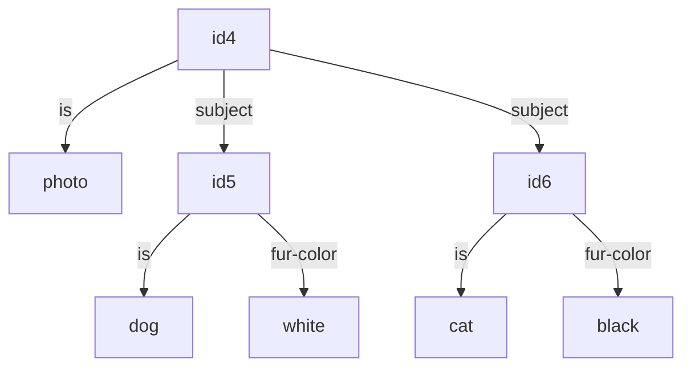

Sunwet is a combined file manager and graph database with media playback capabilities. In short, use it to organize anything! Notes, music, art, photos, video, software, comics, archived websites, scanned documents, financial transactions, appointments, people you know, emails, passwords (encrypted!), etc etc.

This project fills these features:

- Managing a knowledge graph, including adding and querying data

- A very simple ontology to get started with, and a basic tool for importing media

- A web UI

  - For making simple edits to the graph

  - Visualizing query results

  - Consuming media: audio, video, images, epub, `.cb*` comics

I'm hoping that if this catches on there will be community projects to provide more use-case-specific functionality.

So is this a good idea? Read more to find out!

# On organizing things

There are basically two common ways to organize data:

- A hierarchy

  I.e. how you organize files on a computer. There are folders, and each folder/file is a member of exactly one other folder. These are basically strictly nested sets.

  You need to choose a single most significant organizational property to use at the top level of your hierarchy. E.g. when organizing music, you may choose to make your top folder "genre" or "year". This makes looking up data using the non-top-level property more difficult - if your top level is "year", in order to get a list of all "pop" albums from _any_ year, you'd need to go through every year. The more factets you have the worse this gets.

- Tags

  Tags are a more natural way to handle properties like "genre" or "year". You may be familiar with music apps, or ecommerce sites, that allow you to choose "search criteria" - show me all music between these years, in these genres. These are tags. Tags are free sets, and when you do a query you're asking for a combination of sets (like, give me the intersection of "pop" and the union of all year sets from "1970" to "1980").

  But tags have limitations too: Suppose you have a collection of dog and cat photos. You have a photo of a white cat, tagged `cat` and `white-fur`. You have a photo of a black cat, and a white poodle, tagged `cat`, `dog`, `white-fur`, `black-fur`. You can find all photos with cats by searching by tag `cat`, but what if you only want photos of white cats? Searching for `cat` and `white-fur` will also give you the image with a cat and a dog with white fur...

## Sunwet and the knowledge graph

Enter knowledge graphs! Sunwet organizes data as a graph. The graph is basically a database of "triples" consisting of a "subject", "predicate", and "object" (very similar to RDF).

In a knowledge graph you might have triples like:

```
id1 is music_album
id1 name Summer Music
id1 genre pop
id1 year 1973
id1 artist id2
id2 who person1
id2 role trupmetest
id1 artist id3
id3 who person2
id3 role pianist
```



```
id4 is photo
id4 subject id5
id5 is dog
id5 fur-color white
id4 subject id6
id6 is cat
id6 fur-color black
```



You can write queries that move through this graph arbitrarily to do the above and more, like:

- Find all ids where the id "is" "music_album" and the id "year" is between 1970 and 1980
- Find all ids where the id "is" "photo" and any "subject" "is" "cat"
- Find all ids where the id "is" "photo" and any "subject" "is" "cat" and has "fur-color" "white"

Knowledge graphs can handle all the above, arbitrary normalization (i.e. maybe you don't have "subject" but just put "fur-color" directly on "id4" - and you need to write a fur-color query that handles photos with and without subjects), and even things like tag hierarchies.

So are there any practical limitations to knowledge graphs? I'm not sure. But as far as I can tell there's no general purpose software that uses full knowledge graphs today, so Sunwet is an experiment to find out.

# Running Sunwet

## Building

There are two parts: the server, and the front end (html, wasm, static files) which are embedded in the server binary. We currently use `nix` to do the build.

If you're using `nix` a system or working in nix already, you can import the package `source/package.nix`.

If you're not using `nix` elsewhere, you can build the binary with:

```
nix --extra-experimental-features nix-command build \
	--show-trace \
	-f source/standalone.nix \
	-o built \
	config.system.build.sunwet \
	;
```

This will output `built/bin/sunwet`.

## Configuration

Sunwet can use a local monolith configuration file, or a small root configuration file that sets up [`FDAP`](https://github.com/andrewbaxter/openfdap) access to pull the rest of the config. Using FDAP allows you to update the config live and integrates with login portals like [`fdap-login`](https://github.com/andrewbaxter/fdap-login/).

Sunwet can also be configured to use OIDC for user logins or run with no authentication in case you're running it locally or accessing it via a secure tunnel (ex: VPN).

Regardless, you need to create a root config. The root config follows the [JSON spec](./source/generated/jsonschema/config.schema.json) or equivalent [TS spec](./source/generated/ts/index.ts) (`Config`). If you use FDAP there are additional schemas in the above directories for the global config and per-user config.

## Running

Start Sunwet with `sunwet run-server PATH/TO/ROOT/CONFIG.json`.

Once it's running you can access it via CLI or Web UI.

# Data

As described above, Sunwet stores "triples".

In Sunwet the "subject" and "object" are called "nodes" and can be arbitrary JSON or a file. Files are represented in the graph as a hash of the contents, and there's a separate endpoint to fetch the file by its hash.

## Adding and editing data

Data in Sunwet is changed by creating a "commit". A commit is a list of triples to remove and another list of triples to delete.

There are several ways to make commits:

- Using a `form` view in the UI, which creates a commit with new data

- Editing a node in the `node_edit` view in the UI

- Restoring a commit via the `history` view in the UI

- Creating a commit JSON and calling the API directly, then uploading files for new hashes in the triples added in the commit

- Creating a CLI commit JSON then sending it via the CLI (`sunwet commit`)

  The CLI commit JSON uses file paths instead of hashes. Then when you send it via the CLI, the CLI will hash the files, produce and send the API commit JSON, and upload all the files.

  The CLI commit JSON follows this [JSON schema](./source/generated/jsonschema/cli_commit.schema.json)

- Using the CLI media import command (`sunwet prepare-media-import`)

  This scans the given directory for media files and uses media tags (MKV, ID3, EPub, ComicInfo.xml) to generate triples. It will output a `sunwet.json` file you can then commit using `sunwet commit`.

  The prepared commit will match the very basic ontology below.

Having more convenient ways to import data, like a pintrest-like web "save" plugin, would be awesome but is out of scope for the core repo.

## Deleting data

As mentioned above, you can remove a triple in a commit.

Deleted triples will be kept for a year then permanently erased. You can find the commit in history and restore it up until it gets permanently erased.

Files are kept until no triples (deleted or not) refer to them, then they will be automatically deleted.

## Derived files

When you upload certain types of files Sunwet will generate derived files:

- Audio files compatible with common devices

- Video files in web-compatible formats

- Extracted comic pages and metadata for the web reader

- HTML forms of EPUB books

On-demand generation would be great but it's a TODO. Video conversion can take a very long time, so the other derived files are produced first.

## Ontology

An ontology is the set of rules for triples, predicates, formatting subjects, etc you use to organize your data. It's like a schema.

With sunwet you can use any ontology you want, but the default queries and media import tool use this [vocabulary/ontology](./source/shared/src/interface/ont/mod.rs). Generally speaking, albums, tracks, and notes all are UUIDs. They're related and described by the predicates in the ontology. Also see the default config for more context on how the ontology is used.

Ideally there'd be a much more powerful, flexible ontology. At the same time, there are projects to come up with powerful, flexible RDF ontologies that have been going on for decades. Coming up with such an ontology is out of scope for this core repo (but if a widely accepted ontology is created I'd like to update the defaults here to use it).

## Querying data

See [query.md](./query.md)

# CLI

The CLI needs an API token to use.

Set the environment variables

- `SUNWET` - the root URL to the server

- `SUNWET_TOKEN` - the API token you put in the configuration

See `sunwet -h` for details.

# API

The API takes the API token you put in the configuration via the header `Authorization: Bearer TOKEN`.

All requests are via `POST` requests with the payload described by [this JSON schema](./source/generated/jsonschema/api_request.schema.json) and the appropriate response schema.

Errors are text bodies with >= 400 response codes.

# Design notes

## Not URIs

RDF uses URIs for the nodes and predicates. Namespacing and versioning stuff is good, but I decided against it for several reasons:

- Encoding data is hard. Like if you wanted to add a "name" edge with the object being a name - how do you encode that as a URL? It's not obvious, and even if you do know the "correct" way, what about encoding a paragraph of text? Newlines, etc? URL encoding? By contrast, Sunwet uses JSON so you'd just make the name node `"Somebody"`

- RDF proponents suggest URLs with domains - and I didn't want to tie this to the domain name system at all

- It's extremely verbose

## IDs are strings, any value can be an ID

Triples don't make a distinction between content-type data and ids. In early designs I had a distinct "id" type string. I ended up removing it because it complicated the code and I thought it was easier to understand with a simpler model.

The advantage of having an ID type is that tooling could identify IDs and provide better context-aware interactions; for instance, when viewing a query, the UI could show a node link only for ID values, rather than all values on the off chance that one of them is a legitimate ID.

## Custom query language

I originally started this with [cozodb](https://github.com/cozodb/cozo) which used datalog, but doing the sorts of recursive queries I wanted with arbitrary separation between values (i.e. get name at N levels of indirection via X edges) was _extremly_ cumbersome and couldn't be encapsulated/generalized - making larger queries required changes throughout the query and not localized to some clause.

Similarly, I looked at SparQL and it didn't seem much less cumbersome.

I have no doubt that the new query method is limited, and this could turn out to be a terrible idea, but at least for the types of queries I can anticipate right now it's capable and succinct.
