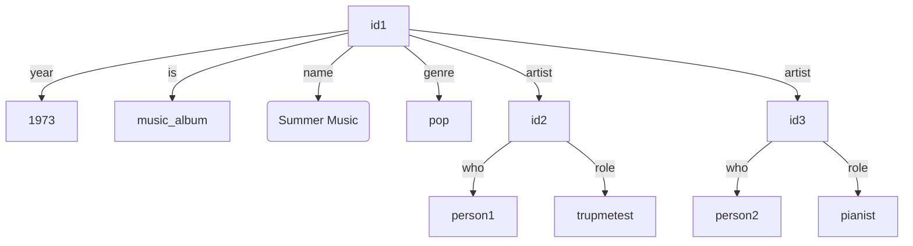
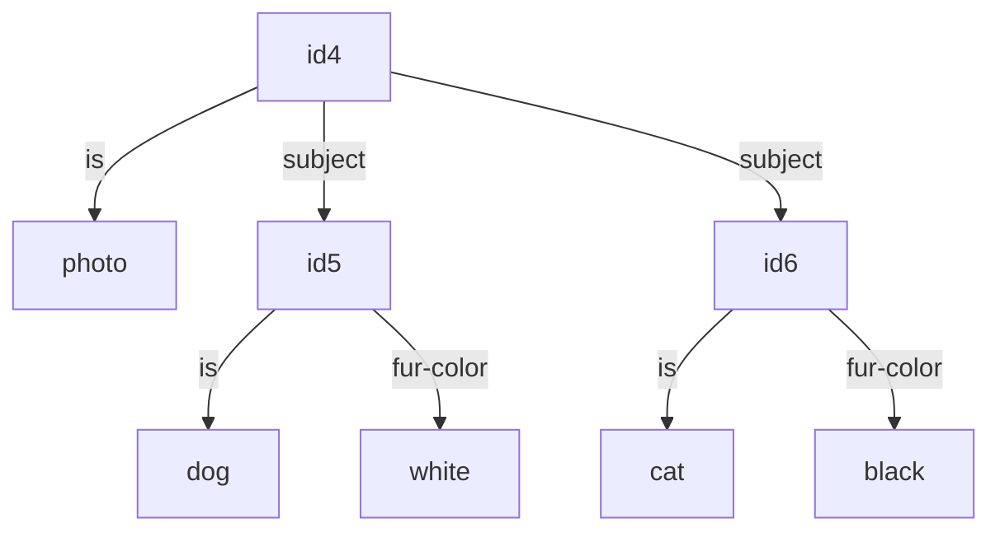

<br />

**Sunwet** is a combined file manager and graph database with media playback capabilities.

Organize anything! Notes, music, art, photos, video, software, comics, archived websites, scanned documents, financial transactions, appointments, people you know, emails, passwords (encrypted!), etc etc.

<br />

<p float="left">
  <a href="https://github.com/andrewbaxter/sunwet-md-media/blob/main/desktop_album_dark2.jpg?raw=true"></a>
  <a href="https://github.com/andrewbaxter/sunwet-md-media/blob/main/desktop_videos_dark1.jpg?raw=true"></a>
  <a href="https://github.com/andrewbaxter/sunwet-md-media/blob/main/desktop_comic_dark11.jpg?raw=true"></a>
  <a href="https://github.com/andrewbaxter/sunwet-md-media/blob/main/mobile_album_dark1.jpg?raw=true"></a>
</p>

<br />

To keep the scope manageable, the goals of the project are to provide:

- A file manager/database itself and API

- A web UI/app for consuming media

- Basic tools for managing the data

I'm hoping that if this catches on better and more specific tooling will be maintained by the community.

<br />

Full list of cool features:

- Play/view audio, video, epub, cbz/cb7, images

- A stylish light/dark theme

- PWA support (required for increased offline storage on iOS)

- "Linked" playing, for listening to music with a friend or an enemy

- Download views for internet-less consumption (e.g. in a natural cave)

- Forms, for easy field data entry, with offline queuing for later upload (e.g. if you're in a natural cave)

- A query editor with bulk edit functionality

- No hardcoded views, everything is fully customizable via config queries and widgets

- Full undo, deleted data kept for a year

- A media import tool, with relations from tags

- A very very basic ontology and default config for easy setup

<br />

<br />

So is this a good idea? Read more to find out!

# On organizing things

There are two common ways to organize data:

- A hierarchy

  I.e. how you organize files on a computer. There are folders, and each folder/file is a member of exactly one other folder. These are basically strictly nested sets.

  You need to choose a single most significant organizational property to use at the top level of your hierarchy. E.g. when organizing music, you may choose to make your top folder "genre" or "year".

  But this makes looking up data using the non-top-level property more difficult - if your top level is "year", in order to get a list of all "pop" albums from _any_ year, you'd need to go through every year. The more factets you have the worse this gets.

- Tags

  Tags are a more natural way to handle properties like "genre" or "year". You may be familiar with music apps, or ecommerce sites, that allow you to choose "search criteria" - show me all music between these years, in these genres. These are tags. Tags are free sets, and when you do a query you're asking for a combination of sets (like, give me the intersection of "pop" and the union of all year sets from "1970" to "1980").

  But tags have limitations too: Suppose you have a collection of dog and cat photos. You have a photo of a white cat, tagged `cat` and `white-fur`. You have a photo of a black cat, and a white poodle, tagged `cat`, `dog`, `white-fur`, `black-fur`. You can find all photos with cats by searching by tag `cat`, but what if you only want photos of white cats? Searching for `cat` and `white-fur` will also give you the image with a cat and a dog with white fur...

## Sunwet and the knowledge graph

Enter knowledge graphs. Sunwet organizes data as a graph. The graph is basically a database of "triples" consisting of a "subject", "predicate", and "object" (very similar to RDF).

In a knowledge graph you might have triples like:

```
id1 is music_album
id1 name Summer Music
id1 genre pop
id1 year 1973
id1 artist id2
id2 who person1
id2 role trupmetest
id1 artist id3
id3 who person2
id3 role pianist
```



```
id4 is photo
id4 subject id5
id5 is dog
id5 fur-color white
id4 subject id6
id6 is cat
id6 fur-color black
```



You can then write queries that move through this graph arbitrarily to do the above and more, like:

- Find all ids where the id "is" "music_album" and the id "year" is between 1970 and 1980
- Find all ids where the id "is" "photo" and any "subject" "is" "cat"
- Find all ids where the id "is" "photo" and any "subject" both "is" "cat" and has "fur-color" "white"

Knowledge graphs can handle all the above, arbitrary normalization (i.e. maybe you don't have "subject" but just put "fur-color" directly on "id4" - and you need to write a fur-color query that handles photos with and without subjects), and even things like tag hierarchies.

Are there any practical limitations to knowledge graphs? I'm not sure. But as far as I can tell there's no general purpose software that's built on knowledge graphs today, so consider it an experiment.

# Running Sunwet

## Building

There are two parts: the server, and the front end (html, wasm, static files) which are embedded in the server binary. We currently use `nix` to do the build.

If you're using a `nix` system or working in nix already, you can import the package `source/package.nix`.

If you're not using `nix` elsewhere, install `nix` and then you can build just the binary with:

```
nix --extra-experimental-features nix-command build \
	--show-trace \
	-f source/standalone.nix \
	-o built \
	config.system.build.sunwet \
	;
```

This will output `built/bin/sunwet`.

Nix adds `ffmpeg`, `pandoc`, `7zz`, and `mkvtoolnix` to the `PATH` via a wrapper script, but if you build some other way you'll need to make sure those are available.

## Quick start

1. Build it - see the instructions above

2. Configure it

   Run `node sunwet/source/local_example.ts > PATH/TO/ROOT/CONFIG.json` to build a basic config. Edit that file and replace paths and names as necessary.

3. Run it

   Run `sunwet run-server PATH/TO/ROOT/CONFIG.json`

This will run a server in single-user mode (no authentication). Open your browser and point it to `http://127.0.0.1:8080` to access the web UI.Add data via UI forms or `sunwet commit`.

For more details, see below.

## Not quick start

### Reference

- Root config file [JSON spec](./source/generated/jsonschema/config.schema.json)
- Root config file [TS spec](./source/generated/ts/index.ts) if you want to generate it via node.js or similar
- [`FDAP`](https://github.com/andrewbaxter/openfdap) for dynamic/remote config
- [`fdap-login`](https://github.com/andrewbaxter/fdap-login/) for multiuser setup, login

### Config

Sunwet can use a local monolith root configuration file or a small root configuration file that sets up [`FDAP`](https://github.com/andrewbaxter/openfdap) access to pull the rest of the config. Using FDAP allows you to update the config live and integrates with login portals like [`fdap-login`](https://github.com/andrewbaxter/fdap-login/).

Sunwet can be configured to use OIDC for user logins or run in single-user mode (with no authentication) in case you're running it locally or accessing it via a secure tunnel (ex: VPN).

If you use FDAP there are additional independent schemas in the `generated` directories for the FDAP global config and FDAP per-user config.

The global config sets up storage paths, views available in the UI, and the menu structure.

The per-user config is mostly permissions for accessing various views.

The config is large, needs JSON queries (which you'll probably want to compile from the query DSL using `sunwet compile-query`), and you'll likely want to repeat bits of config (like making multiple views with different queries but similar display structures) - for these reasons I currently recommend using a typescript script to build (and upload, if using FDAP) the config. This allows you to use variables, call processes to build queries, and upload the data all in one file, and provides type safety and autocomple. There's a complete example config at [./source/fdap_example.ts](./source/fdap_example.ts).

Start Sunwet with `sunwet run-server PATH/TO/ROOT/CONFIG.json`.

Once it's running you can access it at the bind address via CLI or Web UI.

### Web app

Generally I think Sunwet works best in a normal browser. You can use normal bookmarks to pages, views, use back/forward history to navigate, open multiple tabs with different things you're watching, etc.

On iOS in order to have persistent offline data (if you want to download things for offline viewing) you need to install Sunwet as a web app. This means you can't use tabs or bookmarks (though back/forward is possible but is hidden behind magic finger movements).

To set Sunwet up as a web app, open it in your mobile device browser, click the `...`, go to `Share` to bring up the menu that's at least 50% not about sharing things, click `Add to home screen`, then click `Ok` (leave the web app toggle enabled).

### Backing up

You should back up the file and graph directories regularly. If you want a fully consistent backup, you should stop Sunwet before taking the backup. If you're fairly sure you aren't making any commits currently though it should be OK to backup Sunwet while online.

# Data

As described above, Sunwet stores "triples".

In Sunwet the "subject" and "object" are called "nodes" and can be arbitrary JSON or a file. Files are represented in the graph as a hash of the contents, and there's a separate endpoint to fetch the file by its hash.

## Adding, editing, and deleting data

Data in Sunwet is changed by creating a "commit". A commit is a list of triples to remove and another list of triples to delete.

There are several ways to make commits:

- Using a `form` view in the UI, which creates a commit with new data

- Editing a node in the `node_edit` view in the UI

- Restoring a commit via the `history` view in the UI

- Creating a commit JSON and calling the API directly, then uploading files for new hashes in the triples added in the commit

- Creating a CLI commit JSON then sending it via the CLI (`sunwet commit`)

  The CLI commit JSON follows this [JSON schema](./source/generated/jsonschema/cli_commit.schema.json)

  The CLI commit JSON uses file paths instead of hashes. Then when you send it via the CLI, the CLI will hash the files producing a new API commit JSON with file hashes, send commit JSON to the server, then upload all the files.

- Using the CLI media import command (`sunwet prepare-media-import`)

  This scans the given directory for media files and uses media tags (MKV, ID3, EPub, ComicInfo.xml) to generate triples. It will output a `sunwet.json` CLI commit file you can then commit using `sunwet commit`.

  The prepared commit will match the very basic ontology below.

Having more convenient ways to import data, like a pintrest-like web "save" plugin, would be awesome but is out of scope for the core repo.

Deleted triples will be kept for a year then permanently erased. You can find the commit in history and restore it up until it gets permanently erased.

Files are kept until no triples (deleted or not) refer to them, then they will be automatically deleted.

## Derived files

When you upload certain types of files Sunwet will generate derived files:

- Transcoded audio files in device/web-compatible formats

- Transcoded video files in web-compatible formats

- Extracted comic pages and metadata for the web reader

- Transcoded HTML versions of EPUB books

Generation happens in the background. Video conversion can take a very long time, so the other derived files are produced first.

## Ontology

An ontology is the set of rules for triples, predicates, formatting subjects, etc you use to organize your data. It's like a schema.

With sunwet you can use any ontology you want, but the default queries and media import tool use this [vocabulary/ontology](./source/shared/src/interface/ont/mod.rs). Generally speaking, albums, tracks, and notes all are UUIDs. They're related and described by the predicates in the ontology. Also see the default config for more context on how the ontology is used.

Ideally there'd be a much more powerful, flexible, well documented ontology. At the same time, there are projects to come up with powerful, flexible RDF ontologies that have been going on for decades. Coming up with such an ontology is out of scope for this core repo (but if someone comes up with a good ontology I'd like to update the defaults here to use it).

## Querying data

See [source/docs/query.md](./source/docs/query.md)

# CLI

The CLI needs an API token to use.

Set the environment variables

- `SUNWET` - the root URL to the server

- `SUNWET_TOKEN` - the API token you put in the configuration

See `sunwet -h` for details.

# API

The API takes the API token you put in the configuration via the header `Authorization: Bearer TOKEN`.

All requests are via `POST` requests with the payload described by [this JSON schema](./source/generated/jsonschema/api_request.schema.json) and the appropriate response schema.

Errors are text bodies with >= 400 response codes.

# Design notes

See [source/docs/design.md](./source/docs/design.md)
